# Automobile-Sales-Statistics-Dashboard
# Automobile Sales Statistics Dashboard

**Final Submission — February 28, 2025**

This project visualizes and analyzes automobile sales data using Python libraries like Pandas, Matplotlib, and Seaborn. It also features an interactive dashboard created with Plotly Dash. The project is divided into two parts:

- Data Visualizations
- Interactive Dashboard

---

## Task 1: Data Visualization

### 1.1 Yearly Automobile Sales Trend
A line plot showing automobile sales from year to year.

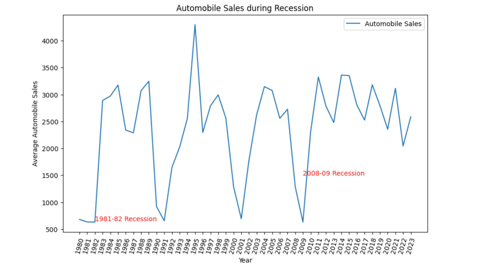

---

### 1.2 Sales Trends by Vehicle Type During Recession
Comparison of sales trends for different vehicle types during recession periods.

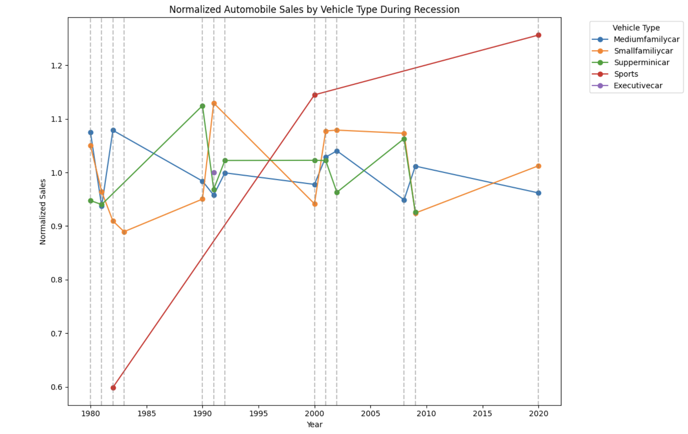

---

### 1.3 Vehicle Sales: Recession vs Non-Recession
Bar chart comparing vehicle sales between recession and non-recession periods.

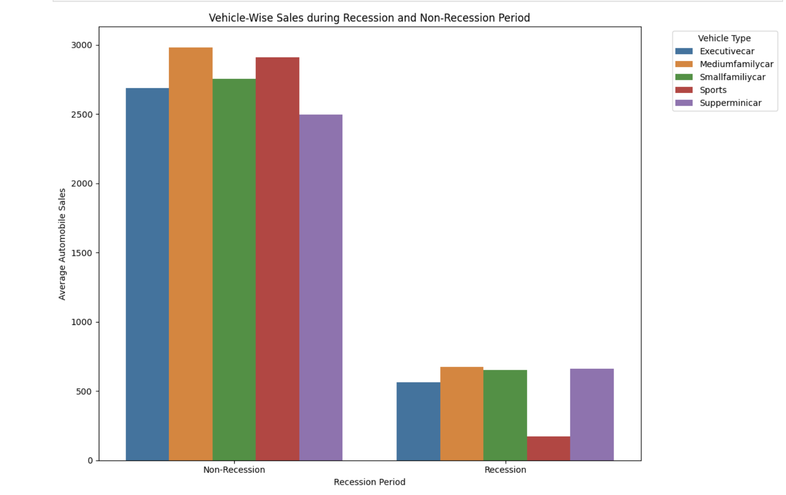

---

### 1.4 GDP Trends: Recession vs Non-Recession
Subplots comparing GDP trends during different economic periods.

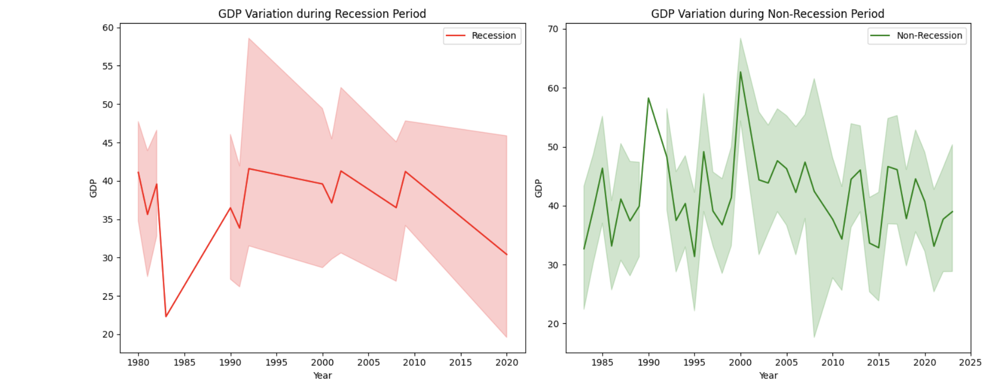

---

### 1.5 Seasonality Impact on Sales
Bubble plot showing how seasonality affects sales.

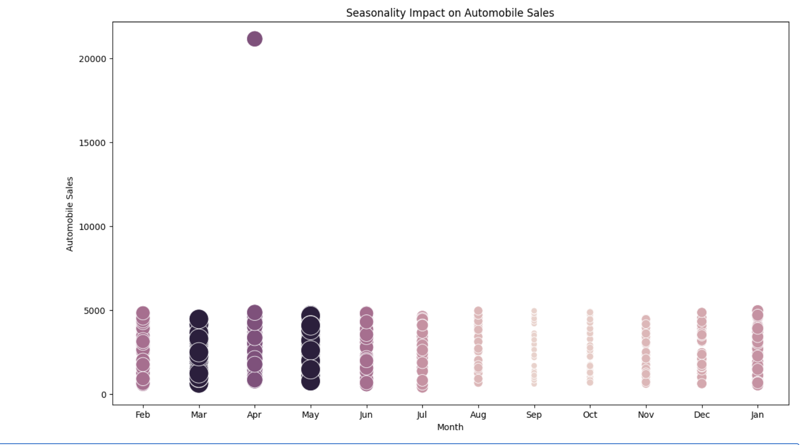

---

### 1.6 Correlation: Average Vehicle Price vs Sales Volume During Recession
Scatter plot illustrating the relationship between vehicle price and sales volume in recession periods.

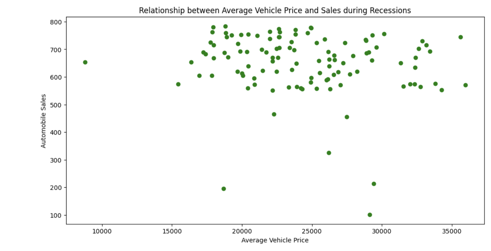

---

### 1.7 Advertising Spend by Economic Period
Pie chart representing advertising expenditures during recession and non-recession periods.

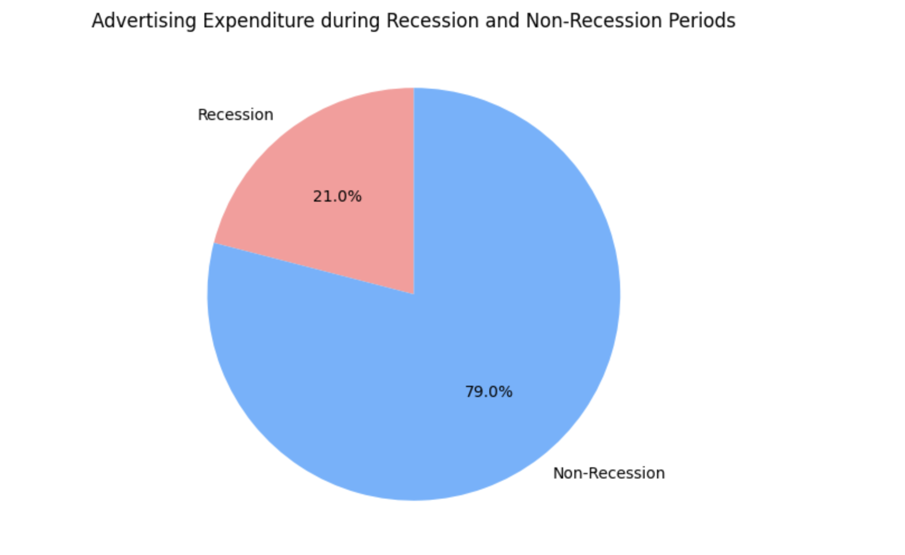

---

### 1.8 Ad Spend by Vehicle Type (Recession)
Pie chart showing ad spend distribution by vehicle type during recession.

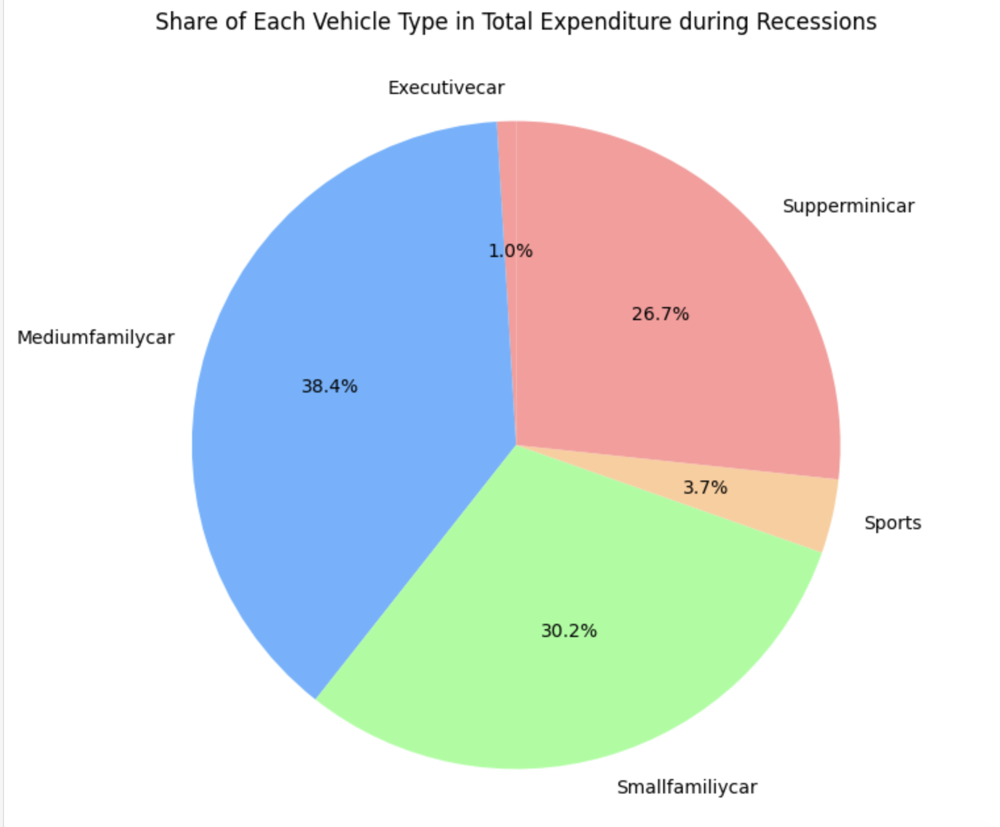

---

### 1.9 Unemployment vs Vehicle Sales During Recession
Line plot showing the effect of unemployment rate on sales across vehicle types during recession.

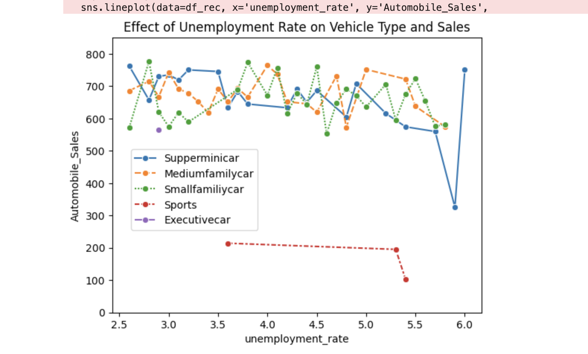

---

## Task 2: Interactive Dashboard (Plotly Dash)

### 2.1 Dashboard Title
Custom dashboard title, styled and centered.

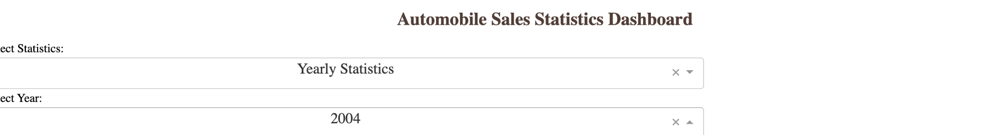

---

### 2.2 Dropdowns
Interactive dropdowns to select statistic type and year.

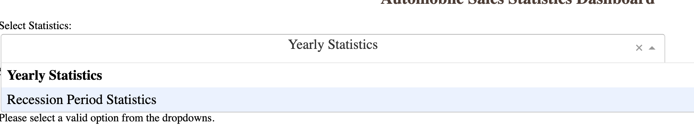

---

### 2.3 Output Display Division
Output container with correct `id` and `className`.

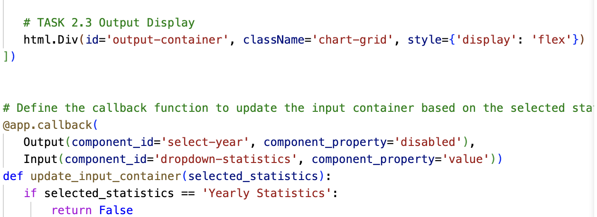

---

### 2.4 Callback Functions
Two functional callbacks:
- One that enables the year dropdown based on selected report type.
- Another that dynamically displays graphs in the output container.

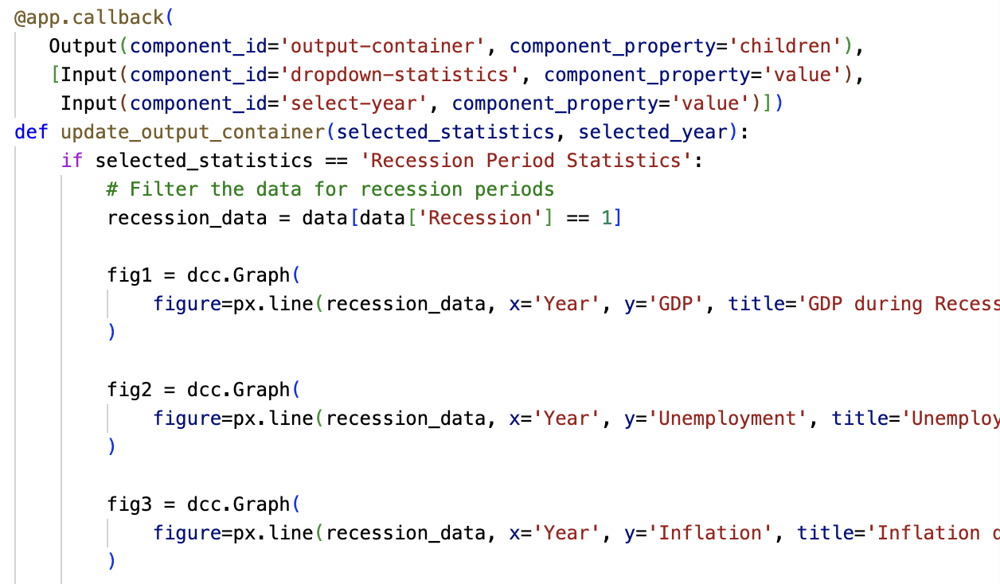

---

### 2.5 Recession Report Graphs
Graphs generated for "Recession Period Statistics" using filtered recession data.

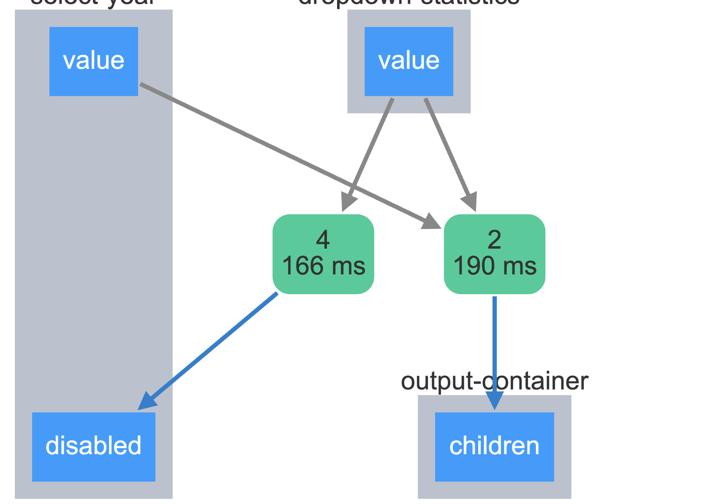

---

### 2.6 Yearly Report Graphs
Graphs generated for "Yearly Statistics", responsive to year selection.

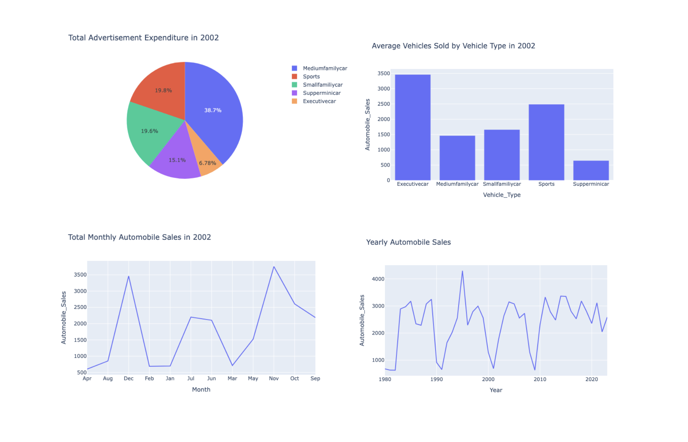

---

## Technologies Used

- Python
- Pandas
- Matplotlib
- Seaborn
- Plotly Dash

---

This project was created as part of a data storytelling and interactive dashboard assignment focused on visualizing trends and patterns in automobile sales.

